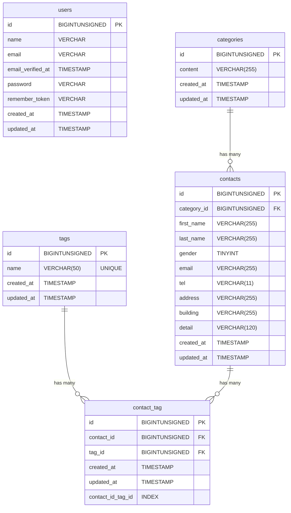

```mermaid

erDiagram
    users {
        id  BIGINTUNSIGNED "PK"
        name VERCHAR
        email VERCHAR
        email_verified_at TIMESTAMP
        password VERCHAR
        remember_token VERCHAR
        created_at TIMESTAMP
        updated_at TIMESTAMP
    }

    categories {
        id BIGINTUNSIGNED "PK"
        content VERCHAR(255)
        created_at TIMESTAMP
        updated_at TIMESTAMP
    }

    contacts {
        id BIGINTUNSIGNED "PK"
        category_id BIGINTUNSIGNED "FK"
        first_name VERCHAR(255)
        last_name VERCHAR(255)
        gender TINYINT
        email VERCHAR(255)
        tel VERCHAR(11)
        address VERCHAR(255)
        building VERCHAR(255)
        detail VERCHAR(120)
        created_at TIMESTAMP
        updated_at TIMESTAMP
    }

    tags {
        id BIGINTUNSIGNED "PK"
        name VERCHAR(50) "UNIQUE"
        created_at TIMESTAMP
        updated_at TIMESTAMP
    }


    contact_tag {
        id BIGINTUNSIGNED "PK"
        contact_id BIGINTUNSIGNED "FK"
        tag_id BIGINTUNSIGNED "FK"
        created_at TIMESTAMP
        updated_at TIMESTAMP
        contact_id_tag_id INDEX
    }

    tags ||--o{ contact_tag : "has many"
    contacts ||--o{ contact_tag : "has many"
    categories ||--o{ contacts : "has many"


```
